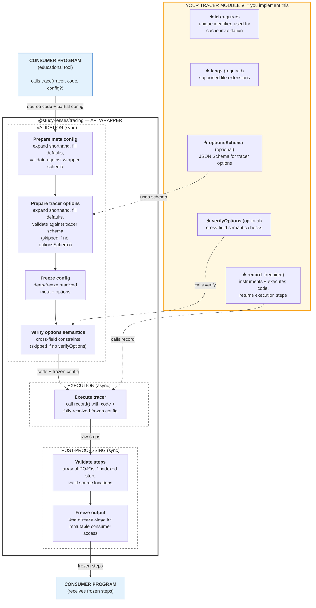

# @study-lenses/trace-\<lang\>-\<engine\> — Architecture & Decisions

## Why this tracer exists

TODO: Describe what language/engine this tracer targets and why it exists as a separate package.

Example: "Instruments Python source code using the X engine, returning a step-by-step
execution trace. Exists as a separate package so other `@study-lenses` tracers can
follow the same `TracerModule` contract without coupling."

## Architecture

```text
code (string)
  → record/index.ts   ← entry point (env detection if needed)
  → record/record.ts  ← your engine: instrument + execute
  → StepCore[]        ← returned via @study-lenses/tracing wrappers
```

`src/index.ts` is wire-up only — no logic. All tracer logic lives in `record/`.

### Pipeline



## Key decisions

### Engine choice

TODO: Why did you choose this engine/approach? What alternatives did you consider?

### Error mapping

TODO: How does your engine signal errors? How do you map them to `ParseError`,
`RuntimeError`, and `LimitExceededError`?

### Step format

TODO: What step shape does your engine produce? How do you adapt it to `StepCore`?
Are steps 0-indexed or 1-indexed internally?

### Options design

TODO: What options does this tracer expose? Why JSON Schema + `verifyOptions`
instead of just one or the other?

## What this package deliberately does NOT do

TODO: List concerns explicitly out of scope.
