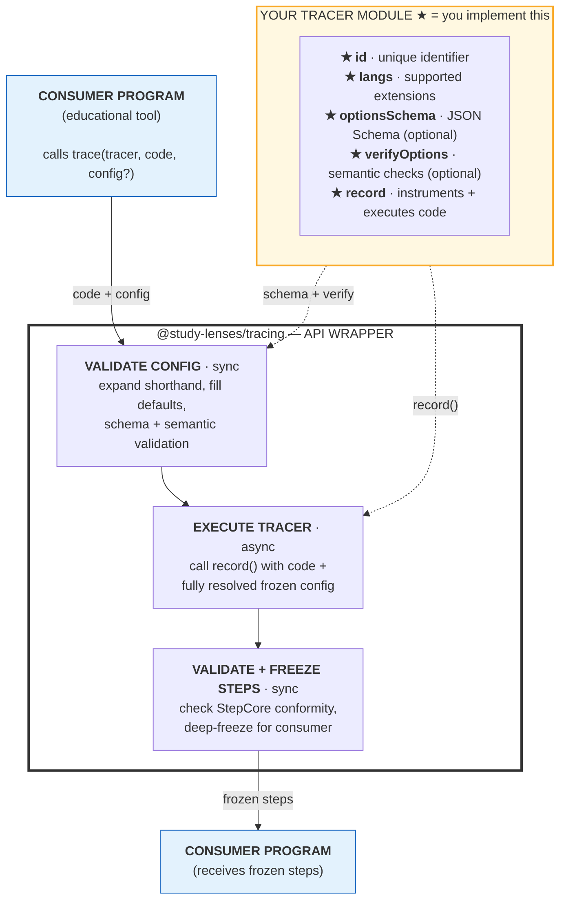

# @study-lenses/CHANGEME

[](https://www.npmjs.com/package/@study-lenses/CHANGEME)
[](https://github.com/OWNER/REPO/actions/workflows/ci.yml)
[](./LICENSE)

> TODO: One sentence — what language/runtime does this tracer instrument?

A `@study-lenses` tracer package. Instruments and executes source code,
returning a step-by-step execution trace for educational tooling.

## Install

```bash
npm install @study-lenses/CHANGEME
```

## Quick Start

```typescript
import trace from '@study-lenses/CHANGEME';

// CHANGEME: replace with a real example for your language
const steps = await trace('let x = 1 + 2;');
console.log(steps);
```

## Tracer Contract

This package implements the `@study-lenses/tracing` tracer interface:

| Export                  | Description                                        |
| ----------------------- | -------------------------------------------------- |
| `trace(code, config?)`  | Instrument and execute code, return steps          |
| `tracify(config)`       | Pre-bind config, return a `trace` function         |
| `embody(code, config?)` | Instrument and execute, return embodied result     |
| `embodify(config)`      | Pre-bind config, return an `embody` function       |
| `tracer`                | The raw `TracerModule` (for introspection)         |

## What to Implement

Fork this repo, then fill in:

1. `src/id.ts` — unique tracer ID (format: `'lang:engine'`)
2. `src/langs.ts` — file extensions this tracer handles
3. `src/options.schema.json` — options this tracer accepts
4. `src/record/` — the actual instrumentation + execution engine
5. `src/verify-options/` — semantic option constraints (if any)

## Architecture

TODO: brief description of the tracer engine and how it instruments code.

### Where Your Tracer Plugs In

The ★ items are what you implement. Everything else is handled by the `@study-lenses/tracing` wrapper — config validation, freezing, steps conformity checks, and error handling.



See [DEV.md](./DEV.md) for full conventions and TDD workflow.

## Contributing

See [CONTRIBUTING.md](./CONTRIBUTING.md) and [DEV.md](./DEV.md).

## License

MIT © [YEAR] [NAME]
